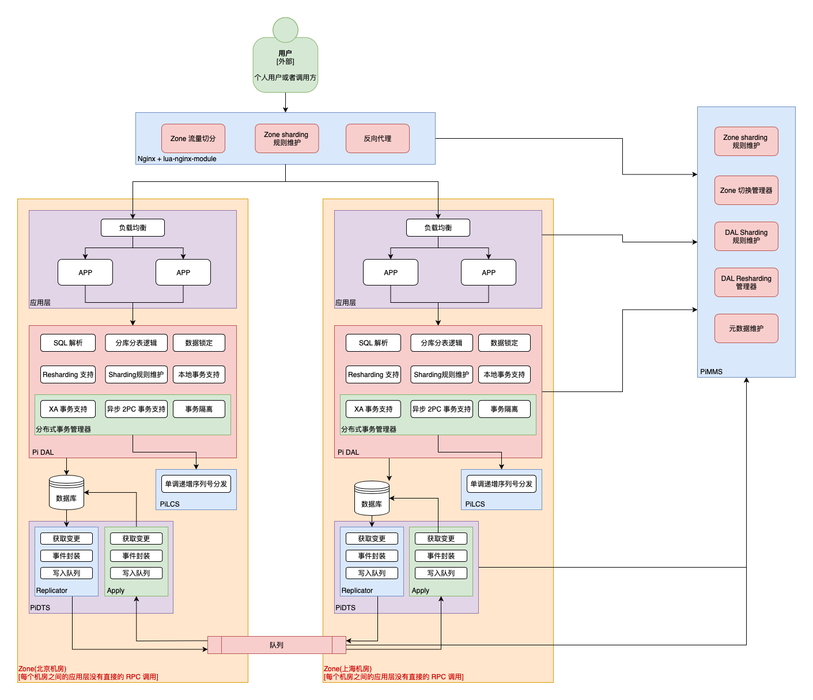

# Pi 计划
Pi 计划的愿景是：让开发这件事变的简单、高效、可靠、稳定。她是一个持续性计划，会产出、更新维护的一系列相关组件、库、服务、文章、思想等。因为开发并不仅仅是代码的编写、执行、项目管理、进度管理、团队协作、跨部门沟通等等。

## Pi 计划第一阶段
提供基于 RDBMS 的异地多活系统和方案。其中需要的组件都是经过抽象，可以被其他业务/场景所复用的。包括

### PiDTS
数据传输服务

