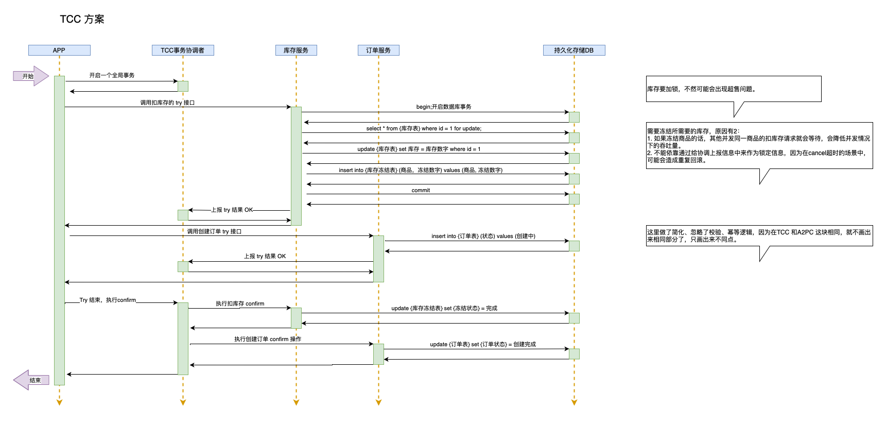
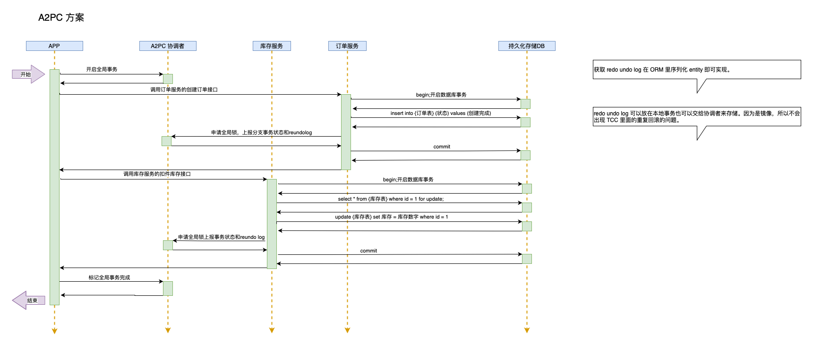

# A2PC 和 TCC 的对比
从挺多角度来讲，这两者其实没有什么可比性的。前者在数据库层面工作，后者面向的是服务、接口。这里找一个一样的场景，在实现的细节上做出比较，论证一下 A2PC 在高并发下的表现情况。
## 场景描述
假设是在下单步骤，为了便于描述，把场景尽量简化，就两个操作。
1. 扣除商品的库存。
2. 创建订单。

另外在时序图里，协调者的操作一样就不在画出来。重点画出来在不一样的地方。

## TCC 时序图

注意：这里在 try 接口没有处理事务悬挂的问题。
- 一个创建订单操作至少需要 16 次 RPC 请求。

## A2PC 时序图

- 一个创建订单操作需要 13 次 RPC 请求。

## 结论

### 网络请求
1. 非必要操作，TCC 就不使用 begin 和 commit 本地事务的情况下，A2PC 比 TCC 少 3 次 RPC
2. 如果启用事务防悬挂，TCC 的 每个 Try 至少增加一次 RPC，相比较 A2PC 就会多 5 次请求。

### 资源锁定周期
1. 订单这类数据锁定周期基本一样。
2. 库存的锁 TCC 可以通过分段的机制优化，但是因为本地锁的存在，所以 TCC 在这种可以冻结部分资源的场景，略有优势。

### 总结
1. 高并发情况下，结合网络请求和资源锁定周期来看，TCC 模式下能扛住的高并发，A2PC 也一样能扛住，两者在表现上应该差异不大。如果没有库存这种可以冻结部分资源的场景下 A2PC 会更有优势。业务改造成本更低。
2. TCC 关注的是服务层面，A2PC 是数据库这类持久化层面，TCC 能解决的问题场景会比 A2PC 更广。两者并不是竞争关系，两者也能同时存在比如在订单状态扭转的 TCC 接口里，用 A2PC 来实现持久化层的分布式事务。

单纯的性能上比拼 A2PC 会占有优势，但是 TCC 和 A2PC 有各自最佳的应用场景，需要根据场景进行方案的选择。