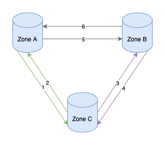

# PiDTS 数据防止回环
在[异地多活](/multi-site-high-availability/introduction)架构中，防止数据回环是数据同步中最重要的一点，即便能保证变更消息不会丢失、顺序也不会错乱数据回环也会引起问题。数据回环不仅仅是在 Zone Sharding 切换的时候需要做，正常的数据复制也需要防止数据回环。

PiDTS 支持异地多活架构设计，在数据防回环中，搭配 [PiDAL](/pidal/introduction) 实现防回环功能。

## 什么是数据回环
数据回环是指在一个双向/多向同步的数据库集群中，在数据库 A 中变更了数据，复制到另外一个数据库 B 中，依然会产生一个变更日志，此时数据库 B 的数据再次同步回数据库 A，如此反复循环下去。在数据新增、变更、删除三种情况下数据回环都会引起问题。以 MySQL 为例解释下数据回环引起的问题。
### 新增数据
在数据库 A 中新增一条数据 `name = "q",age = 20`，此时会产生一条 binlog 并同步 给数据库 B，数据库 B 应用这条 binlog 除了同步了这条记录外同时也产生了一条新增的 binlog ，在双向同步的时候这条 binlog 记录会被同步给数据库 A，如果这个表有唯一性约束就会造成写入失败，如果没有唯一性约束就会造成重复。
### 更新数据
此时数据库 A 和数据库 B 都有一条记录 `age = 20`，此时数据库 A 变更 `age = 21` 同时也会产生一条 binlog 并同步给数据库 B，数据库应用这条日志之后也会产生一条一样的 binlog 并同步给数据库 A，因为数据库 A 里面 已经是 `age = 21` 了，所以这次应用 binlog 并不会因为改变，也不会产生 binlog，数据也不会回环。

但是如果数据库 A 同时变更了两次情况就会完全不同了，数据库 A 先是 `age = 21`，然后又变更了一次数据 `age = 22`。这样就会产生两条 binlog 同步给数据库 B。数据库 B 应用这两条 binlog 之后，也会产生两条 binlog，顺序也是先 `age = 21` 然后 `age = 22`。当第一条 binlog 同步给数据库 A 的时候，A 会被设置为 `age = 21`，然后第二条 binlog 会被变更为 `age = 21`，这样有产生了两条 binlog 并同步给数据库 B，如此反复循环下去。
### 删除数据
删除和更新比较类似，在先新增后删除连续两个操作的情况下，也会和更新一样陷入「新增 -> 删除 -> 新增」 的无限循环下去。
### 解决方案
PiDTS 通过增加在数据库表中增加一个字段来解决回环问题，搭配 PiDAL 在数据变更的时候自动维护这个字段，能做到业务无感知。
在这个新增的字段里，包含产生此次一次变更发生的 Zone ID ，在数据同步的时候会一起同步出去，当这个数据被同步回来的时候，通过对比 Zone ID 如果和本 Zone ID  一致就丢弃，进而防止数据回环的发生。整体原则可以概括为，谁负责写入同步谁产生的数据。

### 三个及以上 Zone 的情况
如果是两个 Zone 互相同步就比较好判断，当三个及以上 Zone 的情况就需要额外处理了。假设有 A、B、C 三个 Zone ，就以 ZSID = 1 的数据同步情况为例。

由[保证任何时候一份数据只会被一个Zone写入](./保证任何时候一份数据只会被一个Zone写入) 我们可以保障任何一个时间只会被一个 Zone 写入。假设此时 ZSID = 1 被 Zone A 写入，Zone B 收到同步请求之后会应用到本地，然后各自 binlog 被同步给 Zone C 和 Zone A，Zone A 判断是自己本地产生的变更，会忽略这条 binlog。Zone C 判断这条数据应该由 Zone A 写入，但是 binlog 是 Zone B 同步过来的，也会忽略这条 binlog，由此在三个及以上的 Zone 的情况也能保障同步的安全。